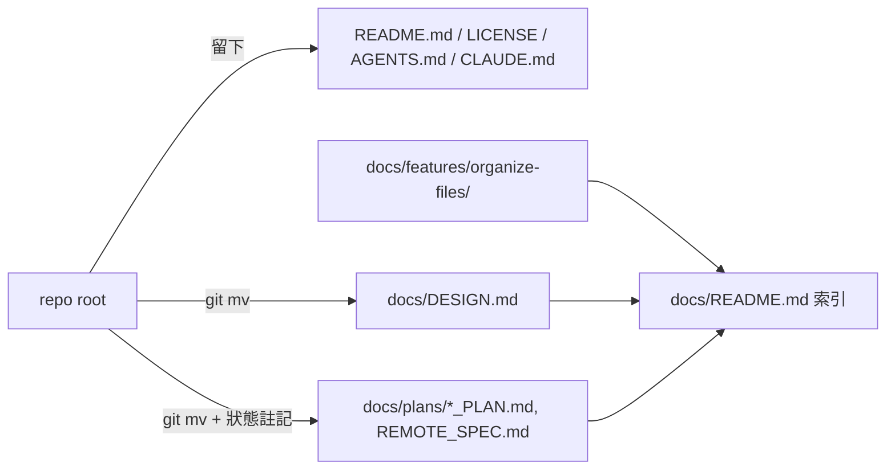

# Plan：整理專案文件

- 狀態：已確認
- 對應 Spec：[spec.md](./spec.md)
- Spec 確認依據：2026-10-03 spec.md（依任務指示授權）
- 更新日期：2026-10-03
- 確認紀錄：2026-10-03 依任務指示授權（卡片要求規劃後實作並自動開 PR），未另行逐份確認。

## 現有程式碼調查

| 檔案 | 現況與調查依據 |
| --- | --- |
| `DESIGN.md` | 設計系統參考（Stitch 格式 frontmatter）。`renderer/styles/globals.css:16,19,69-70` 的註解引用它；`test/ui-consistency.test.mjs` 守的 radius ladder 出自它。**現行參考，保留。** |
| `CORE_SPLIT_PLAN.md` | core 拆分／多前端遷移計畫（Claude Docs 2026-10-01 匯出快照）。v4 已完成，Electron 已移除；現行架構以 `AGENTS.md` 為準。文末待決事項仍有未勾選項（npm 名稱實際已定為 `@kw-yeh/vibeflow`）。**已完成，保留作決策記錄。** |
| `AGENT_MODELS_PLAN.md` | model 清單改由 agent CLI 取得；`7887793` 實作，`packages/core/src/agent-models.ts` 存在、`agent-connections.ts` 已刪。**已完成。** |
| `LIBRARY_PLAN.md` | Library 投遞計畫；Phase 0–3、5 標 ✅，Phase 4「協議瘦身」未標記。路徑寫 `main/helpers/`、`npm run dev`（Electron 時代），現行實作在 `packages/core/src/library.ts`。含 Phase 0 實測結果，有保存價值。**已完成（Phase 4 狀態未記錄）。** |
| `MARKDOWN_RENDERING_PLAN.md` | 檔頭已標「已實作完成」。文中 `main/helpers/plan-html.ts`、`markdown.ts` 已不存在（plan HTML 路徑已移除），`renderer/…:<行號>` 相對連結移入 `docs/plans/` 後會斷。**已完成。** |
| `TERMINAL_TABS_PLAN.md` | `renderer/components/terminal-tab-bar.tsx` 現存；文中 electron-store、`npm run dev` 為舊描述。**已完成。** |
| `REMOTE_SPEC.md` | 檔頭寫「待實作」、架構圖寫 Electron。實際上 host 端已實作在 `renderer/hooks/use-remote-host.ts` + `renderer/components/remote-share-dialog.tsx`（PeerJS，`vf:state` / `client:*` 訊息與規格一致），由 `renderer/pages/home.tsx` 掛載。**部分實作，狀態欄過時。** |
| `packages/core/IPC_API_MAP.md` | 與程式碼同處，`AGENTS.md` 規定 handler table 改動時更新它；開頭「see the migration plan」沒有連結。**留在原處，補連結。** |
| `test/README.md` | 測試清單只列 6 支（實際 31 支），且說明來源寫 repo `CLAUDE.md`（實為 `AGENTS.md`）。**留在原處，更新內容。** |
| `scripts/build-npm.mjs:77-85` | npm 套件只帶 `dist`、`README.md`、`LICENSE`，不受文件搬移影響。 |
| `git grep` 舊檔名 | 引用只出現在 `AGENTS.md`（IPC_API_MAP）、`globals.css`（DESIGN.md）、`CORE_SPLIT_PLAN.md`（純文字提到 LIBRARY_PLAN / REMOTE_SPEC）、`AGENT_MODELS_PLAN.md`（IPC_API_MAP）。CI workflow、腳本、測試都沒有讀根目錄文件。 |

## 方案與取捨

- **單一 `docs/` 目錄**，同時容納 skill 預設的 `docs/features/<slug>/`。卡片寫「doc」，但用 `docs/` 可避免 `doc/` 與 `docs/features/` 兩個資料夾並存，且是 GitHub 慣例。
- **結構**：`docs/DESIGN.md`（現行參考）＋ `docs/plans/`（已完成或部分實作的規劃，作為決策記錄）＋ `docs/features/<slug>/`（之後用 spec／plan 流程產生的文件）＋ `docs/README.md` 索引。
- **保留原檔名**（`CORE_SPLIT_PLAN.md` 等），不改成 kebab-case：文件之間以檔名互相引用、使用者也以檔名記憶；`DESIGN.md` 是工具會辨識的慣用名。
- **不刪任何文件**：六份規劃都含仍有效的「為什麼」（例如 Library 的 Phase 0 實測、Markdown 的 sanitize 決策），`AGENTS.md` 也強調決策記錄的價值。過時的是狀態與路徑，以檔頭註記處理，不改正文。
- **連結修正例外**：`MARKDOWN_RENDERING_PLAN.md` 的 `renderer/…` 相對連結是機械性路徑修正，加 `../../` 前綴，不視為改寫正文。

## 預計修改

| 檔案 | 修改內容 | 對應驗收條件 |
| --- | --- | --- |
| `DESIGN.md` → `docs/DESIGN.md` | `git mv` | AC-1 |
| `*_PLAN.md`、`REMOTE_SPEC.md` → `docs/plans/` | `git mv`；檔頭加狀態註記；修 Markdown 連結 | AC-1、AC-3、AC-4 |
| `docs/README.md`（新增） | 文件索引：路徑、性質、狀態、現行實作位置、放置規則 | AC-2 |
| `AGENTS.md` | project structure 加 `docs/`；新增「Docs」段落說明放置規則；IPC_API_MAP 引用不變 | AC-5 |
| `renderer/styles/globals.css` | 註解中的 `DESIGN.md` → `docs/DESIGN.md` | AC-4 |
| `packages/core/IPC_API_MAP.md` | 「see the migration plan」補上 `docs/plans/CORE_SPLIT_PLAN.md` 連結 | AC-4 |
| `test/README.md` | 測試清單改成 31 支的實際對照；`CLAUDE.md` → `AGENTS.md` | AC-6 |
| `docs/features/organize-files/{spec,plan}.md`（新增） | 本功能文件 | — |

## 實作順序

1. `git mv` 7 份文件 → `ls *.md` 確認根目錄。
2. 加狀態註記、修連結 → 逐份對照程式碼現況。
3. 寫 `docs/README.md`、更新 `AGENTS.md`、`globals.css`、`IPC_API_MAP.md`、`test/README.md`。
4. `git grep` 舊檔名與相對連結檢查 → 跑驗證命令。

## 風險與依賴

- 外部（GitHub issue、聊天、Claude Docs）若有連到根目錄舊路徑的連結會失效；GitHub 不做 redirect。影響低（皆為內部規劃文件），以 PR 描述告知。
- 其他進行中分支若改到這些文件會產生 rename 衝突；git 的 rename detection 通常能處理。

## 驗證計畫

| 檢查 | 命令或操作 | 對應驗收條件 |
| --- | --- | --- |
| 根目錄只剩入口文件 | `ls *.md` | AC-1 |
| 歷史可追 | `git log --follow --oneline docs/plans/LIBRARY_PLAN.md` | AC-1 |
| 沒有殘留舊路徑 | `git grep -nE '(^|[^/])(DESIGN|CORE_SPLIT_PLAN|…)\.md'` 逐筆檢查 | AC-4 |
| 相對連結可解析 | 小腳本掃 `docs/**/*.md`、`AGENTS.md`、`test/README.md`、`IPC_API_MAP.md` 的相對連結並 `fs.existsSync` | AC-2、AC-4 |
| 測試清單一致 | 比對 `ls test/*.test.mjs` 與 `test/README.md` 表格 | AC-6 |
| Core typecheck | `npx tsc --noEmit -p tsconfig.json` | AC-7 |
| Renderer typecheck | `npx tsc --noEmit -p renderer/tsconfig.json` | AC-7 |
| 測試 | `npm test` | AC-7 |

`npm run build:web` / `test:e2e` / runtime check：本次只改 CSS 註解與文件，不影響建置輸出或行為，不執行。

## 待確認事項

- 無

## 實作與驗證紀錄

2026-10-03 實作完成：

- 7 份根目錄文件以 `git mv` 移入 `docs/`、`docs/plans/`；根目錄 `ls *.md` 只剩 `AGENTS.md`、`CLAUDE.md`、`README.md`（AC-1）。
- 六份規劃文件檔頭加上狀態註記，引用的 commit 與檔案路徑皆以 `git log` / `ls` 核對（AC-3）；`MARKDOWN_RENDERING_PLAN.md` 的 6 個 `renderer/…` 連結加上 `../../`。
- 新增 `docs/README.md` 索引（AC-2）；`AGENTS.md` 加入 `docs/`、`test/` 結構與「Docs」段落（AC-5）；`test/README.md` 表格改為 31 支 suite、改指向 `AGENTS.md`（AC-6）。
- `git grep` 舊檔名：除 `AGENTS.md` 結構樹中 `docs/` 底下的 `DESIGN.md` 一行外，全部指向 `docs/`（AC-4）。
- 連結檢查（掃 `docs/**`、`AGENTS.md`、`README.md`、`test/README.md`、`IPC_API_MAP.md`）：25 個相對連結，唯二「失效」是 `MARKDOWN_RENDERING_PLAN.md` 表格中 `` 的語法範例，不是連結（AC-4）。
- `npx tsc --noEmit -p tsconfig.json`：通過。`npx tsc --noEmit -p renderer/tsconfig.json`：通過（worktree 的 `node_modules` 不完整，先跑了 `npm ci --ignore-scripts`）。
- `npm test`：265 tests，258 pass、5 skipped、2 fail。失敗的是 `test/artifacts.test.mjs` 的 `listArtifacts — skips symlinks` 與 `readArtifact — refuses a symlink pointing outside the directory`，都在 `fs.symlink` 階段 `EPERM`——這台 Windows 沒有建立 symlink 的權限，與本次（只改文件與 CSS 註解）無關；`ui-consistency` 通過（AC-7 部分受環境限制）。
- 未執行 `npm run build:web`、`test:e2e`、runtime check：沒有行為或建置輸出變更。
